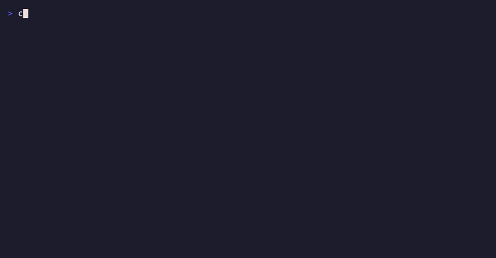
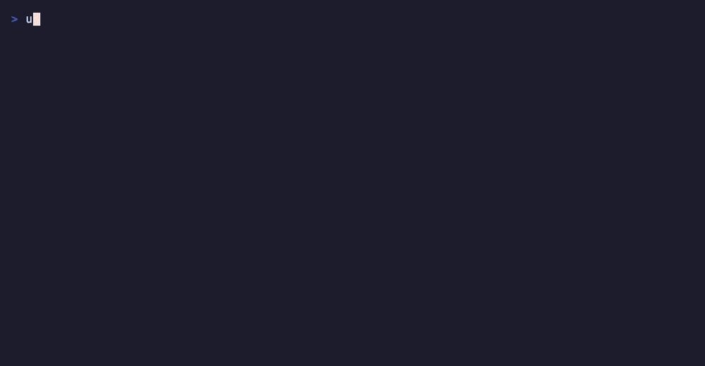

# Demos

See obsidian-second-brain working before you install anything. Every demo on this page is real footage: the commands actually ran, and the GIF is rendered from a committed [vhs](https://github.com/charmbracelet/vhs) tape file, so it can be re-rendered pixel-perfect for any future version. All demos use synthetic data (throwaway vaults, fictional names) - no real vault ever appears on this page.

## Install as a Claude Code plugin

Two commands and the whole skill is installed: 44 commands, the session hooks, and the vault MCP server.



What you're seeing: `claude plugin marketplace add` clones the repo as a marketplace, `claude plugin install` ships the plugin, and `claude plugin list` confirms it's enabled. Same flow works as `/plugin` slash commands inside a session. Full install docs: [README - Install](README.md#install).

Tape: [media/plugin-install.tape](media/plugin-install.tape)

## Bootstrap a vault that passes its own health check

No vault yet? One command creates a ready-to-use one - folders, templates, kanban boards, goals, a `_CLAUDE.md` operating manual - and the health checker proves it's clean.



What you're seeing: `bootstrap_vault.py` builds the vault (it never overwrites existing files - keep-by-default, `--force` is the only overwrite consent), then `vault_health.py` scans it and reports zero issues. Docs: [README - No vault yet?](README.md#install).

Tape: [media/bootstrap-health.tape](media/bootstrap-health.tape)

## Re-rendering a demo

```bash
brew install vhs   # or: go install github.com/charmbracelet/vhs@latest
vhs media/plugin-install.tape
```

## Adding a demo

1. Write a `.tape` file (see the two committed ones for the house style: Catppuccin Mocha, 1000x520, font 15).
2. Point it at throwaway data only - a `mktemp -d` config dir or a bootstrapped scratch vault with a fictional owner. **Never record a real vault.**
3. Render with `vhs`, check every frame is clean, commit the `.gif` and the `.tape` together under `media/`.
4. Add a section here: what it shows, the GIF, the tape link.
